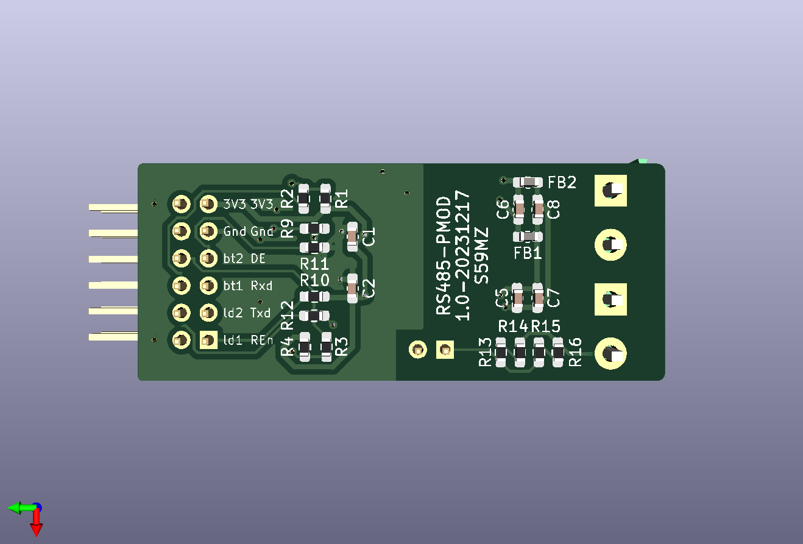

# kicad-pmod_rs485
PMOD PCB module for RS-485 Interface 

Schematic:
[kicad-pmod_rs485.pdf](kicad-pmod_rs485.pdf)

BOM:
[kicad-pmod_rs485.csv](kicad-pmod_rs485.csv)

Gerbers:
[gerbers.zip](https://github.com/s59mz/kicad-pmod_rs485/raw/main/gerbers.zip)
